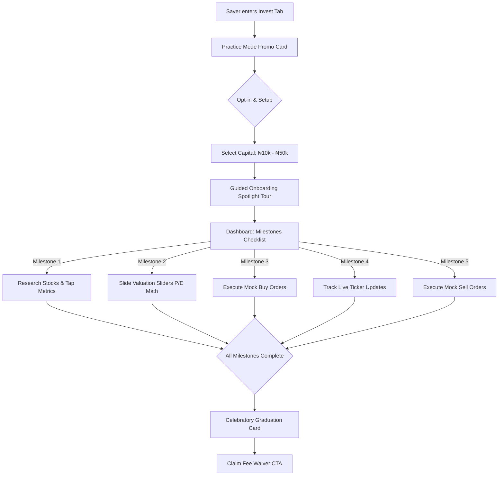
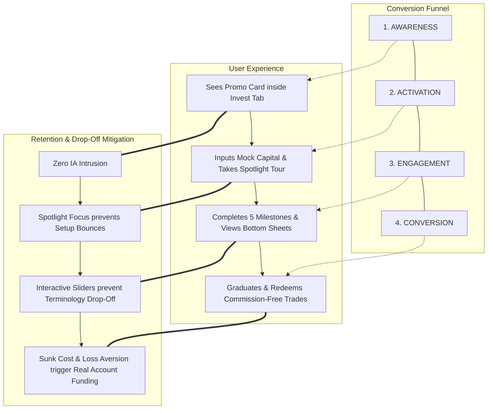

# Product Strategy Case Study: Cowrywise "Paper Trade"

> **Author's Note**: This is a high-level product strategy exploration demonstrating how a Product Manager can leverage an existing design system to solve a critical user conversion bottleneck. 
> 
> *A fully interactive React + TypeScript prototype of this proposal was built to validate the layout and user experience, which is detailed in the footnote.*

---

## 1. The Problem & Strategic Context

Savings and mutual funds have successfully democratized entry-level wealth management. However, transitioning a passive "Saver" into an active "Stock Market Investor" involves a massive psychological hurdle. 

Currently, the average user of saving and investment tools is left with blog posts and static "How Stocks Work" articles. These resources are passive. A user might read an article on market valuation, but close the app without taking action because the fear of losing real money remains too high. **Passive education does not build execution confidence.**

### The Core Challenge:
> **How might I help users build execution confidence in real-time and learn about stocks in a way that is active, hands-on, and risk-free?**

### The Strategic Opportunity:
Modern wealth platforms already possess real-time market price feeds and premium native trading interfaces. By introducing an embedded "Paper Trade" (mock trading) environment, this proposal bridges the gap between financial theory and practical execution—using a simulator as a low-risk gateway to convert savers into active stock investors.

---

## 2. The Solution: Embedded Financial Education

The proposed solution embeds a practice environment directly within the native iOS experience. The feature employs "Embedded Financial Education" to guide users through their first steps:

*   **Contextual Tooltips:** Asset Metrics like P/E Ratio or Dividend Yield are tapable. Tapping them triggers "Action-Driven Insights" that demystify the data exactly when the user is making a mock trade (e.g., *"P/E ratio of 5.2 means investors are paying ₦5.2 for every ₦1 of GTCO annual earnings"*).
*   **Interactive Math & Valuation Sliders:** Breaking down formulas (Price ÷ Earnings) visually so the user understands the mechanics behind the asset. Tapping the P/E cell slides up a Bottom Sheet featuring an interactive slider calculator where users adjust price and earnings to watch valuation multiples compute in real time.
*   **Realistic Anchoring:** Onboarding prompts users to input a realistic amount (₦10k - ₦50k) rather than a generic "₦1 Million." This maps the emotional stakes and percentage returns accurately to their actual financial reality.
*   **Practice Milestones Checklist:** To drive day-1 activation and prevent the "Dead Portfolio" bounce, the dashboard features a gamified "Practice Journey" checklist. Each milestone completed advances a progress bar, leading to a graduation reward.
*   **Full-Cycle Trading Execution:** An HIG-compliant buy/sell sliding segmented control lets users practice position exits. This ensures they learn when to cut losses or take profits, which is critical for reducing anxiety during real market downturns.

### Visualized User Journey
To map out the interactive steps, the diagram below outlines the sequential user flow from entrance to graduation:

---

## 3. The Conversion Funnel & Reward Rationale

A common failure point of financial simulators is that they become isolated playgrounds. Users engage with the simulator but never cross the chasm to real-money investments. This strategy resolves this friction through a two-part conversion mechanism:

### Part A: Psychological Transition (Zero-Friction UI)
Because the Paper Trading interface is **visually identical** to the real-money stock-trading screens, completing mock trades builds direct muscle memory. The user learns exactly where buttons are, how to input numbers, and how to read the stock chart. 
Upon completing the milestones, the transition is seamless: the "Graduation Certificate" provides a single tap to switch the view to "Real Mode." Because they have already mastered this exact screen layout, the user's navigational anxiety is reduced to zero.

### Part B: Incentive Rationale (The Sunk Cost Reward)
Gaining confidence is not enough; the platform must also overcome the financial activation barrier. This strategy proposes a **Trade Fee Waiver** (e.g., zero commissions on their first 3 transactions) as the graduation reward:
* **The Endowment Effect:** Because the user had to "work" to unlock this reward by completing the 5 practice milestones, they assign a high perceived value to it. 
* **Loss Aversion:** If they graduate but do not open a funded account, this hard-earned waiver will expire. This triggers standard loss aversion and sunk-cost psychology—users are highly motivated to use a reward they feel they have already "paid for" with their time and effort.
* **Instant Gratification:** Placing the reward CTA directly on the graduation card captures them at the moment of highest enthusiasm and confidence, converting them before cognitive friction sets in.

### The Conversion Funnel Map
This diagram visualizes how the user actions map directly to the business conversion funnel, showing the drop-off mitigation points:

---

## 4. Product Impact & Expected Outcomes

By aligning user education with transactional execution, this feature aims to achieve the following outcomes:

*   **Primary Conversion Lift:** A target **15–20% increase in real stock account activations** among users who complete the 7-day paper trading challenge.
*   **High-Value Leads:** Savers are pre-qualified and pre-educated before making their first real trade, leading to a higher average first-deposit value.
*   **Reduced Customer Support Load:** The contextual explainer sheets act as a first line of support, reducing basic "How do stocks work?" customer support tickets by an estimated 30%.
*   **Increased User Retention (LTV):** Users who understand stock market metrics and volatility are less likely to panic-sell during market corrections, resulting in longer investor lifecycles.

---

## 5. Key Assumptions Made
This strategy relies on the following assumptions:
1.  **Desire to Learn:** Users actually want to invest in stocks but are held back by fear/lack of knowledge, not a lack of capital.
2.  **Transferable Confidence:** Confidence gained in a mock environment will reliably translate to real-money environments.
3.  **KYC Compliance:** The target user cohort has already completed all standard platform KYC requirements during their savings setup, removing account-opening verification friction from this specific conversion funnel.
4.  **Market Favorable Conditions:** If a user's paper portfolio performs poorly due to a market downturn during their 7-day trial, they may be discouraged from investing. This strategy assumes the contextual education (teaching holding periods) will mitigate this panic.

---

## 6. Tradeoffs & Risks
*   **Engineering Effort vs. Core Product:** Building a robust mock ledger takes engineering resources away from real-money features. *The Tradeoff: The long-term LTV of an educated investor heavily outweighs the short-term development cost of the mock ledger.*
*   **Simulator vs. Seriousness:** If the feature feels too game-like, users may take wild risks they wouldn't take in real life, learning bad habits. *Mitigation: Enforcing strict minimum/maximum starting balances and realistic pricing constraints.*
*   **Data Costs:** Allowing thousands of users to mock-trade means more hits to real-time price feeds and WebSockets. This is a negative risk factor, as it could dramatically increase 3rd-party data provider costs without guaranteeing immediate revenue. This requires rate-limiting considerations from engineering.

---

## 7. Success & Failure Metrics
How to evaluate if the strategy is working:

### 🟢 Success Signals (KPIs)
*   **Activation Rate:** % of users who set a virtual balance who successfully execute their first mock order.
*   **Education Engagement:** Number of interactions with the tapable 'Asset Metrics' (e.g., viewing the P/E ratio formula or bottom-sheet insights) per mock trade session.
*   **The North Star (Conversion Rate):** % of paper traders who convert to a live, funded investment account within 30 days of their first mock trade.
*   **Support Load:** A reduction in basic "How do stocks work?" customer support tickets.

### 🔴 Failure Signals
*   **High Setup Drop-off:** Users open the "Set Virtual Balance" modal but bounce before completing it (indicating the value prop isn't clear).
*   **The "Dead Portfolio":** Users execute one mock trade and never check the dashboard again.
*   **Zero Conversion:** High engagement in the practice environment, but 0% transition to real money. This would indicate a highly utilized simulator that failed in its primary objective as a sales funnel to real investments.

---

## 8. Phased Rollout & Testing Strategy
To properly test this theory before a general release, I propose a phased rollout targeting two very specific user cohorts:

*   **Segment A (The "Disciplined Saver"):** Users who have maintained consistent saving habits for 3+ months but have *never* purchased a stock.
    *   *Rationale:* These users already trust the platform and have capital available, but lack execution confidence in equities.
*   **Segment B (The "New Sign-up"):** Brand new users going through their first week of onboarding.
    *   *Rationale:* To test if immediate exposure to a risk-free simulator accelerates their time-to-first-investment compared to historical baselines.

---

## 📱 Prototype Footnote

**Built with Antigravity & TypeScript**: 
To prove the viability of this strategy, I built a fully functional frontend simulation prototype using React, TypeScript, and **Antigravity**. Leveraging my design and development background allowed me to construct a high-fidelity visual showcase of the entire product flow.

By building this interactive prototype, I was able to:
1. Walk internal stakeholders (leadership, engineering leads, compliance, design teams) through the exact onboarding tour, constants grids, P/E sliders, and graduation checkpoints.
2. Demonstrate layout constraints (e.g. keyboard margins and checklist item alignments) in real time.
3. Obtain strategic buy-in and alignment **without** allocating core engineering and design resources to database modeling or WebSocket APIs.

This codebase acts as a visual showcase of the problem exploration and a concrete proposal of my product approach.
