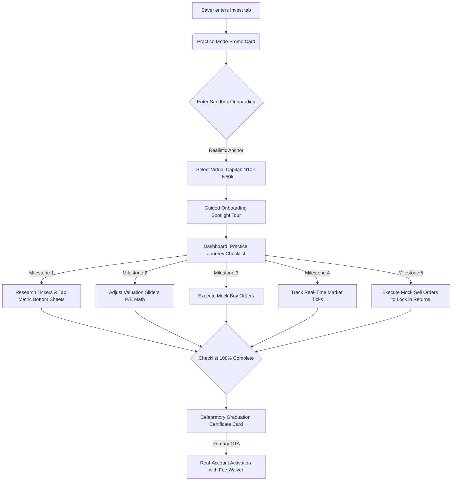

# Product Strategy Case Study: Cowrywise "Paper Trade"

> **Disclaimer**: This is a high-level problem-solving exploration. It is not intended to be a perfect technical specification, but rather a strategic product document demonstrating how a Product Manager would leverage an existing design system to solve a specific user conversion hurdle.

---

## 1. The Problem & Strategic Context
Savings and mutual funds have successfully democratized entry-level finance. However, transitioning a passive "Saver" into an active "Stock Market Investor" involves a massive psychological leap. 

Currently, the average user of saving and investment tools is left with blog posts and static "How Stocks Work" articles. These resources are largely passive. A user might read an article on valuation multiples, but close the app having taken no action because the fear of losing real money remains too high. **Passive education does not build execution confidence.**

### The Core Challenge:
> **How might we help users build execution confidence in real-time and learn about stocks in a way that is not passive?**

**The Strategic Opportunity:** Platforms like Cowrywise already possess real-time market data feeds and premium native trading interfaces. By introducing an embedded "Paper Trade" (mock trading) environment, we can bridge the gap between financial theory and practical execution, using a simulator as a low-risk gateway to convert savers into stock market investors.

---

## 2. The Solution: Embedded Financial Education

The approach is to embed a practice environment directly within the native iOS experience. The feature employs "Embedded Financial Education" to guide users through their first steps:

*   **Contextual Tooltips:** Asset Metrics like P/E Ratio or Dividend Yield are tapable. Tapping them triggers "Action-Driven Insights" that demystify the data exactly when the user is making a mock trade (e.g., *"P/E ratio of 5.2 means investors are paying ₦5.2 for every ₦1 of GTCO annual earnings"*).
*   **Interactive Math & Valuation Sliders:** Breaking down formulas (Price ÷ Earnings) visually so the user understands the mechanics behind the asset. Tapping the P/E cell slides up a Bottom Sheet featuring an interactive slider calculator where users adjust price and earnings to watch valuation multiples compute in real time.
*   **Realistic Anchoring:** The onboarding is designed so users don't start with an arbitrary "₦1 Million." They are prompted to input a realistic amount (₦10k - ₦50k) so the emotional stakes and percentage returns map accurately to their actual financial reality.
*   **Practice Milestones Checklist:** To drive day-1 activation and prevent the "Dead Portfolio" bounce, the dashboard features a gamified "Practice Journey" checklist. Each milestone completed advances a progress bar, culminating in a graduation certificate that unlocks a fee waiver on their first real trade.
*   **Full-Cycle Trading Execution:** An HIG-compliant buy/sell sliding segmented control lets users practice position exits. This ensures they learn when to cut losses or take profits, which is critical for reducing anxiety during real market downturns.

### Visualized User Journey & Conversion Funnel
Mermaid diagrams render directly in Markdown environments to showcase the workflow visually:

---

## 3. The Conversion Funnel & Reward Rationale

A common pitfall of financial simulators is that they become "sandboxed islands"—users engage with the simulator but never cross the chasm to real-money investments. This strategy resolves this friction through a two-part conversion mechanism:

### Part A: Psychological Transition (Zero-Friction UI)
Because the Paper Trading interface is **visually identical** to the real-money stock-trading screens, completing mock trades builds direct muscle memory. The user learns exactly where buttons are, how to input numbers, and how to read the stock chart. 
Upon completing the milestones, the transition is seamless: the "Graduation Certificate" provides a single tap to switch the view to "Real Mode." Because they have already mastered this exact screen layout, the user's navigational anxiety is reduced to zero.

### Part B: Incentive Rationale (The Sunk Cost Reward)
Gaining confidence is not enough; we must also overcome the financial activation barrier. We propose a **Trade Fee Waiver** (e.g., zero commissions on their first 3 transactions) as the graduation reward:
* **The Endowment Effect:** Because the user had to "work" to unlock this reward by completing the 5 practice milestones, they assign a high perceived value to it. 
* **Loss Aversion:** If they graduate but do not open a funded account, this hard-earned waiver will expire. This triggers standard loss aversion and sunk-cost psychology—users are highly motivated to use a reward they feel they have already "paid for" with their time and effort.
* **Instant Gratification:** Placing the reward CTA directly on the graduation card captures them at the moment of highest enthusiasm and confidence, converting them before cognitive friction sets in.

---

## 4. Proposed Strategy Evaluation: Will it Work?

For this strategy to succeed in production, we must evaluate both its strengths and potential friction points:

### Why the Strategy Will Work (The Bull Case)
1. **Lowers Capital Friction:** Users do not need to deposit new external capital. The platform can allow savers to easily sweep a small fraction of their existing idle cash balances or matured savings into their new stock wallet, making the first trade feel seamless.
2. **Mitigates Choice Paralysis:** The search explorer highlights a curated "NGX 30" index rather than presenting thousands of options. Limiting choices helps users take action quickly.
3. **Structured Learning Loop:** By enforcing both "Buy" and "Sell" milestones, we ensure users learn the complete cycle of trading, making them feel like capable investors.

### Gaps & Potential Failure Points (The Bear Case)
1. **The Volatility Disincentive:** Savings accounts in Nigeria offer stable, predictable interest rates. If a user tries paper stocks during a market downturn and watches their mock portfolio drop, they may conclude that stocks are too risky and retreat to passive savings.
   * *Mitigation:* We must include automated tip cards during market dips explaining that temporary downturns are standard, showing long-term historical recovery charts.
2. **KYC Drop-off:** Entering the sandbox requires zero friction (no documents needed). However, transitioning to real stocks requires strict regulatory KYC (BVN validation, address verification). This represents a massive hurdle.
   * *Mitigation:* We must allow users to initiate the KYC verification process in the background *while* they are in the 7-day practice mode, ensuring their real account is fully verified by the time they graduate.

---

## 5. Product Outcomes & Expected Impact
What must happen to consider this a valid, successful feature?

*   **Primary Outcome:** Transform passive, cash-holding users into qualified, educated leads for the stock product.
*   **Expected Impact:** A valid hypothesis of impact is that we will see a **15–20% increase in real investment account activations** among users who complete the 7-day paper trading challenge.
*   **User Benefit:** Users gain the confidence to execute trades and understand market volatility without risking their capital.

---

## 6. Key Assumptions Made
For this strategy to succeed, we rely on the following assumptions:
1.  **Desire to Learn:** Users actually want to invest in stocks but are held back by fear/lack of knowledge, not a lack of capital.
2.  **Transferable Confidence:** Confidence gained in a mock environment will reliably translate to real-money environments.
3.  **Market Favorable Conditions:** If a user's paper portfolio performs poorly due to a market downturn during their 7-day trial, they may be *discouraged* from investing. We assume our contextual education (teaching holding periods) will mitigate this panic.

---

## 7. Tradeoffs & Risks
*   **Engineering Effort vs. Core Product:** Building a robust mock ledger takes engineering resources away from real-money features. *The Tradeoff: The long-term LTV of an educated investor heavily outweighs the short-term development cost of the mock ledger.*
*   **Simulator vs. Seriousness:** If the feature feels too game-like, users may take wild risks they wouldn't take in real life, learning bad habits. *Mitigation: Enforcing strict minimum/maximum starting balances and realistic pricing constraints.*
*   **Data Costs:** Allowing thousands of users to mock-trade means more hits to real-time price feeds and WebSockets. This is a negative risk factor, as it could dramatically increase 3rd-party data provider costs without guaranteeing immediate revenue. This requires rate-limiting considerations from engineering.

---

## 8. Success & Failure Metrics
How will we know if the strategy is working?

### 🟢 Success Signals (KPIs)
*   **Activation Rate:** % of users who set a virtual balance who successfully execute their first mock order.
*   **Education Engagement:** Number of interactions with the tapable 'Asset Metrics' (e.g., viewing the P/E ratio formula or bottom-sheet insights) per mock trade session.
*   **The North Star (Conversion Rate):** % of paper traders who convert to a live, funded investment account within 30 days of their first mock trade.
*   **Support Load:** A reduction in basic "How do stocks work?" customer support tickets.

### 🔴 Failure Signals
*   **High Setup Drop-off:** Users open the "Set Virtual Balance" modal but bounce before completing it (indicating the value prop isn't clear).
*   **The "Dead Portfolio":** Users execute one mock trade and never check the dashboard again.
*   **Zero Conversion:** High engagement in the practice environment, but 0% transition to real money. This would indicate we built a highly utilized simulator that failed in its primary objective as a sales funnel to real investments.

---

## 9. Phased Rollout & Testing Strategy
To properly test this theory before a general release, I would structure a phased rollout targeting two very specific user cohorts:

*   **Segment A (The "Disciplined Saver"):** Users who have maintained consistent saving habits for 3+ months but have *never* purchased a stock.
    *   *Rationale:* These users already trust the platform and have capital available, but lack execution confidence in equities.
*   **Segment B (The "New Sign-up"):** Brand new users going through their first week of onboarding.
    *   *Rationale:* To test if immediate exposure to a risk-free simulator accelerates their time-to-first-investment compared to historical baselines.

---

## 10. Implementation Barriers & Open Questions
As the PM driving this feature, these are the critical questions to investigate with engineering and compliance teams:

1.  **Data Architecture:** Can the current WebSocket price feed be cleanly abstracted so that mock trades listen to it, but write to a completely separate, non-regulated `mock_ledger` database without hitting rate limits?
2.  **Component Reusability:** How modular is the current `GTCO Transaction` UI? Can we simply pass an `isMock: true` flag to the existing view, or do we have to rebuild the entire bottom-sheet to prevent accidental real-money execution?
3.  **Compliance:** Do we need specific legal disclaimers to ensure regulators do not view our mock trading environment as financial advisory or an unregistered inducement to trade?
4.  **Notification Fatigue:** If we send a 7-day "Comparative Performance Report" push notification, how does that fit into the user's existing push notification limits for the week?

---

## 📱 Prototype Footnote

**Built with Antigravity & TypeScript**: 
To prove the viability of this strategy, I built a fully functional frontend simulation prototype using React, TypeScript, and **Antigravity**. Leveraging my design and development background allowed me to construct a high-fidelity visual showcase of the entire product flow.

By building this interactive prototype, we can:
1. Walk internal stakeholders (leadership, engineering leads, compliance, design teams) through the exact onboarding tour, constants grids, P/E sliders, and graduation checkpoints.
2. Demonstrate layout constraints (e.g. keyboard margins and checklist item alignments) in real time.
3. Obtain strategic buy-in and alignment **without** allocating core engineering and design resources to database modeling or WebSocket APIs.

This codebase acts as a visual showcase of the problem exploration and a concrete proposal of my product approach.
